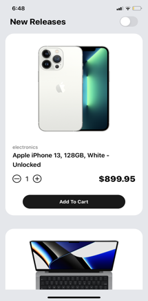
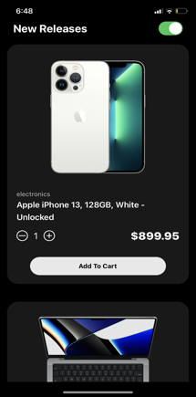

# Mobile Store UI

This is a follow-up to the simple store UI repository, specifically designed for mobile devices. Please visit the following link to access it:

```sh
https://carrot2803.github.io/Store-UI/
```

A secondary goal was to become more familiar with incorporating dynamic theming on mobile. If you are knowledgeable about this, please feel free to direct message me.

## App Availability

You can download the app at [App Link](https://expo.dev/@carrot_28/ecommerce-ui)

## Installation

<details>
<summary>
  <code>There are several ways to save this repository on your device. Two of these options include:</code>
</summary>

-   [Downloading repository as ZIP](https://github.com/carrot2803/Mobile-Store-UI/archive/refs/heads/master.zip)
-   Running the following command in a terminal, provided the [GitHub CLI](https://cli.github.com/) has been previously installed:

```sh
git clone https://github.com/carrot2803/Mobile-Store-UI.git
```

<code>Install React and dependencies: </code>

Run the following command to install the required dependencies:

```sh
npm i
```

Run the app: Connect your device or emulator, and run the following command to launch the app:

```sh
npm start
```

</details>

## Snippets

Splash Page(Loading Screen)


Light Mode


Dark Mode

